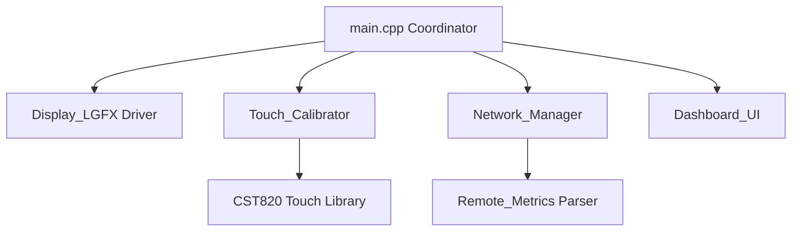

# ESP32 Touchscreen PZEM-004T Dashboard

A high-performance, modular metrics dashboard for ESP32 designed to display real-time sensor information (Voltage, Current, Energy, Power) retrieved from local HTTP Prometheus endpoints (such as ESPHome or Home Assistant devices).

The display driver is powered by **LovyanGFX** interfacing with an **ST7789** controller over a high-speed parallel bus, with **LVGL v8.3.11** serving as the graphical user interface framework.

---

## Key Features

* **Layered Modular Architecture**: Decoupled design separating the UI rendering loops, background networking threads, and low-level driver implementations.
* **Core-0 Asynchronous Metrics Fetch**: Metrics collection is offloaded to a background FreeRTOS task pinned to ESP32 **Core 0**, using thread-safe Mutex synchronization. This leaves **Core 1** dedicated exclusively to the UI, guaranteeing a smooth GUI refresh rate with zero network-induced lag.
* **Dynamic Prometheus Target Config**: Parametrized metrics target by dividing the URL into **Metrics IP** and **Metrics Path** (defaulting to `/metrics`). Configurable directly inside the Settings UI and persisted via NVS.
* **Intelligent Network Manager with Boot Priority**: Cycles through a list of saved Wi-Fi networks on boot. When explicitly connecting to a network from the settings modal, it is prioritized at index 0 of the NVS storage to ensure seamless reconnects on reboot.
* **Unified Persistent Keyboard Overlay**: A single persistent, semi-transparent (75% opacity) keyboard attached to `lv_layer_top()` overlaps modals and text fields, displaying on focus and automatically hiding when defocused.
* **Heads-Up Display (HUD)**: A dynamic top-layer overlay providing quick access to Settings and Display Brightness.
* **Hardware PWM Brightness Control & Reset**: Adjust the LCD backlight smoothly using a built-in UI slider. Brightness preferences are saved to NVS. Tapping outside the slider panel on the dark background overlay reverts screen brightness to its pre-modal value and exits without committing changes.
* **Metrics Failure Visual Indicator**: An overlay warning icon (`LV_SYMBOL_WARNING`) appears automatically when the background metrics fetch task fails or times out.
* **3-Point Affine Touch Calibration**: Integrates a visual 4-point calibration utility on boot that solves for the 6 coefficients of an affine transformation matrix. Calibration coefficients are saved persistently to ESP32 NVS.
* **Flicker-Free Display Tuning**: Customized LVGL refresh periods and a reduced parallel bus frequency (20 MHz) optimized for signal integrity on prototype wiring.

---

## Architecture Overview

### Component Structure
* **`src/main.cpp`**: Main entry point coordinating hardware initialization, loading/running calibration, applying brightness, and driving the LVGL main handler loop.
* **`include/Display_LGFX.h` / `src/Display_LGFX.cpp`**: LovyanGFX display configuration for the ST7789 panel running on an 8-bit parallel bus, including `Light_PWM` backlight control.
* **`include/Touch_Calibrator.h` / `src/Touch_Calibrator.cpp`**: 4-corner calibration UI and NVS storage manager.
* **`include/Network_Manager.h` / `src/Network_Manager.cpp`**: Wi-Fi multi-network cycling, NVS credential storage (SSID/Password and Metrics IP/Path configs), and asynchronous FreeRTOS network task.
* **`include/Remote_Metrics.h` / `src/Remote_Metrics.cpp`**: Text-based Prometheus HTTP client parser.
* **`include/Dashboard_UI.h` / `src/Dashboard_UI.cpp`**: LVGL UI layout creating the 2x2 grid cards, zoom details, HUD, Brightness Slider (with cancel click-out), and the scrollable Settings/Wi-Fi Manager interface.
* **`lib/CST820/`**: Statically isolated private PlatformIO driver library for the CST820 touchpad controller.

---

## Hardware Configuration & Pin Map

### ST7789 MCU8080 8-Bit Parallel Display
| Signal | ESP32 GPIO | Description |
|--------|------------|-------------|
| `WR`   | GPIO 4     | Write Clock |
| `RD`   | GPIO 2     | Read Clock |
| `RS`   | GPIO 16    | Register Select (DC) |
| `CS`   | GPIO 17    | Chip Select |
| `RST`  | Unused     | Hardware Reset |
| `BLK`  | GPIO 0     | PWM Backlight Control |
| `D0`   | GPIO 15    | Data Bit 0 |
| `D1`   | GPIO 13    | Data Bit 1 |
| `D2`   | GPIO 12    | Data Bit 2 |
| `D3`   | GPIO 14    | Data Bit 3 |
| `D4`   | GPIO 27    | Data Bit 4 |
| `D5`   | GPIO 25    | Data Bit 5 |
| `D6`   | GPIO 33    | Data Bit 6 |
| `D7`   | GPIO 32    | Data Bit 7 |

### CST820 Capacitive Touch Controller (I2C)
| Signal | ESP32 GPIO | Description |
|--------|------------|-------------|
| `SDA`  | GPIO 21    | I2C Data Line |
| `SCL`  | GPIO 22    | I2C Clock Line |
| `RST`  | Unused     | Reset Pin |
| `INT`  | Unused     | Interrupt Pin |

### Official Board Documentation
For deeper hardware details, schematics, and component datasheets provided by the vendor (Sunton), refer to the files included in the `docs/` directory:
* **Board Schematics & Specs**: `ESP32-2432S022 Specifications-EN.pdf`, `ESP32-2432022-LCM-V1.0.png`, `ESP32-2432022-MCU-V1.0.png`, `Dimensions.jpg`
* **Core Components**: `ESP32-WROOM-32.PDF`, `ESP32-WROOM-1 Pin definition.png`, `25Q32JVSSIQ.PDF` (Flash), `FM8002A.PDF` (Audio Amp)
* **Touch Controller**: `CST820 数据手册V1.1.pdf` (CST820 Datasheet)
* **Quick Start**: `Getting started 2.2.pdf`

---

## Installation & Setup

1. **Prerequisites**: Install [VSCode](https://code.visualstudio.com/) and the [PlatformIO IDE](https://platformio.org/) extension.
2. **Initial Boot Configuration**: On first boot, there are no saved networks or metrics configuration. Open the settings screen using the UI gear icon to scan/add a Wi-Fi network and input your target Prometheus metrics server IP and path (defaults to `/metrics`).
3. **Partition Table**: Since the project integrates LVGL fonts, the binary size exceeds the standard 1.2MB partition. The [platformio.ini](file:///c:/Users/marco/Documentos/PlatformIO/Projects/esp32_touchscreen/platformio.ini) is configured with `board_build.partitions = huge_app.csv` to allocate **3.0 MB** for the program, ensuring compilation succeeds out-of-the-box.

---

## Compilation & Flashing

Use PlatformIO shortcut commands in VSCode to build and deploy:
* **Build**: `ctrl` + `alt` + `b`
* **Upload**: `ctrl` + `alt` + `u`
* **Monitor**: `ctrl` + `alt` + `s` (Set to `115200` baud)
